# Storage Class Hierarchy

This document describes the class hierarchy of `fleche`'s storage subsystem
as of PR #245.


---

## Overview

The storage subsystem is split into five orthogonal layers:

| Layer | Purpose | Key types |
|---|---|---|
| **Abstract Backend** | Primitive key/value operations | `StorageBackend` |
| **Domain Interfaces** | Type-safe save/load contracts | `ValueStorage`, `CallStorage` |
| **Bridge Mixins** | Connect domain interfaces to a backend | `ValueMixin`, `CallMixin`, `DestructuringMixin` |
| **Backend Implementations** | Storage-medium logic (how data is stored) | `MemoryBackend`, `VoidBackend`, `PickleFileBackend`, … |
| **Typed Concrete Classes** | Mixin × Backend, ready to use | `ValueMemory`, `CallMemory`, `ValuePickleFile`, … |

---

## Layer 1 — `StorageBackend` (ABC)

```
StorageBackend(ABC)
├── put(value, key) : Digest    ← abstract
├── get(key) : Any              ← abstract
├── _evict(key)                 ← abstract
├── list() : Iterable[Digest]   ← abstract
│
└── (concrete key-management helpers)
    ├── evict(key)          normalises str → Digest, then calls _evict()
    ├── contains(key) : bool
    ├── expand(key)         resolves a short prefix to the full digest
    └── shrink(key)         finds the shortest unambiguous prefix
```

`StorageBackend` is the lowest-level contract.  Any class that stores
key-value pairs implements `put`/`get`/`_evict`/`list`.  The key-management
helpers (`evict`, `contains`, `expand`, `shrink`) are implemented once here
and inherited by everyone.

---

## Layer 2 — Domain Interfaces (`ValueStorage`, `CallStorage`)

These ABCs express **what** is stored, independent of **how**:

```
ValueStorage(ABC)
├── save(value: Any, key?: Digest) : Digest
└── load(key: Digest | str) : Any

CallStorage(ABC)
├── save(call: Call) : Digest
└── load(key: Digest | str) : Call
```

Neither interface inherits from `StorageBackend`.  This separation keeps
the domain contracts free of backend concerns and allows them to be
type-checked in isolation.

---

## Layer 3 — Bridge Mixins (`ValueMixin`, `CallMixin`, `DestructuringMixin`)

The bridge mixins combine a domain interface with `StorageBackend` using
multiple inheritance, providing concrete implementations of `save`/`load`
in terms of `put`/`get`:

```python
class ValueMixin(ValueStorage, StorageBackend):
    def save(self, value, key=None):
        if key is None:
            key = digest(value)     # hash the value if no key given
        return self.put(value, key)

    def load(self, key):
        key = self.expand(key) if len(key) < DIGEST_LENGTH else Digest(key)
        return self.get(key)
```

```python
class CallMixin(CallStorage, StorageBackend):
    def save(self, call: Call):
        key = call.to_lookup_key()  # key derived from call identity
        if self.contains(str(key)):
            self.evict(str(key))    # evict stale entry before overwrite
        return self.put(call, key)

    def load(self, key):
        key = self.expand(key) if len(key) < DIGEST_LENGTH else Digest(key)
        return self.get(key)

    # Extra domain methods only meaningful for calls:
    def transform(self, func): ...
    def query(self, template: QueryCall): ...
```

`DestructuringMixin` hooks in at the *backend* level—it overrides `put`/`get`
on `StorageBackend` to transparently split nested collections (lists, dicts)
into individually-stored sub-values.  Because it inherits only from
`StorageBackend` it can be composed into either a value or call storage chain:

```python
class DestructuringValueMemory(ValueMixin, DestructuringMixin, MemoryBackend):
    pass
```

---

## Layer 4 — Backend Implementations

These classes implement the `StorageBackend` primitives (`put`/`get`/`_evict`/`list`)
for a specific storage medium.  They are **not** typed (value vs. call) — that
role belongs to the mixins above.

| Class | Storage medium | Notes |
|---|---|---|
| `MemoryBackend` | Python `dict` | Deep-copies on put/get to prevent aliasing; mutable, so not hashable |
| `VoidBackend` | Nothing (no-op) | Useful as a placeholder or in tests |
| `FileStorage` | Filesystem | Abstract; subclasses implement `_to_file`/`_from_file` |
| `PickleFileBackend` | Files (pickle/cloudpickle/dill) | HMAC-signed, optional gzip compression |
| `BagOfHoldingH5FileBackend` | HDF5 files | Via the `bagofholding` library |
| `SqlBackend` | SQLAlchemy (default: SQLite) | Stores `Call` fields in a relational schema |

---

## Layer 5 — Typed Concrete Classes

Each typed concrete class is a one-liner that combines the appropriate mixin
with a backend implementation.  The naming convention is `{Value|Call}{Backend}`.

### Value storage (inherit from `ValueMixin`)

| Class | Backend |
|---|---|
| `ValueMemory` | `MemoryBackend` |
| `ValueVoid` | `VoidBackend` |
| `ValuePickleFile` | `PickleFileBackend` |
| `ValueBagOfHoldingH5File` | `BagOfHoldingH5FileBackend` |

### Call storage (inherit from `CallMixin`)

| Class | Backend | Notes |
|---|---|---|
| `CallMemory` | `MemoryBackend` | |
| `CallVoid` | `VoidBackend` | |
| `CallPickleFile` | `PickleFileBackend` | |
| `CallBagOfHoldingH5File` | `BagOfHoldingH5FileBackend` | |
| `Sql` | `SqlBackend` | Call-only; `query()` pushes filters to SQL |

---

## Composition patterns

`Cache` (in `caches.py`) combines one value storage with one call storage:

```python
@dataclass
class Cache(BaseCache):
    values: ValueStorage    # e.g. ValueMemory() or ValuePickleFile(...)
    calls:  CallStorage     # e.g. CallMemory() or Sql()
```

To add destructuring to any backend, prepend `DestructuringMixin` in the MRO:

```python
class DestructuringValuePickleFile(ValueMixin, DestructuringMixin, PickleFileBackend):
    pass
```

---

## DOT source

The diagram above can be regenerated with:
`dot -Tsvg devnotes/storage-hierarchy.dot -o devnotes/storage-hierarchy.svg`

```dot
digraph StorageHierarchy {
    rankdir=TB; splines=ortho; nodesep=0.6; ranksep=0.8;

    // ABCs
    StorageBackend  [label="{«ABC»\nStorageBackend|put/get/_evict/list|evict/contains/expand/shrink}",
                     shape=record, style="filled,rounded", fillcolor="#BDD7EE"]
    ValueStorage    [label="{«ABC»\nValueStorage|save(value,key?)\lload(key)\l}",
                     shape=record, style="filled,rounded", fillcolor="#C6E0B4"]
    CallStorage     [label="{«ABC»\nCallStorage|save(call)\lload(key)→Call\l}",
                     shape=record, style="filled,rounded", fillcolor="#C6E0B4"]

    // Bridge mixins
    ValueMixin          [label="{ValueMixin|save/load via put/get\l}",
                         shape=record, style="filled,rounded", fillcolor="#FFE699"]
    CallMixin           [label="{CallMixin|save/load/transform/query\l}",
                         shape=record, style="filled,rounded", fillcolor="#FFE699"]
    DestructuringMixin  [label="{DestructuringMixin|overrides put/get\lremaining_depth:int\l}",
                         shape=record, style="filled,rounded", fillcolor="#FCE4D6"]

    // Backend implementations
    MemoryBackend           [label="{MemoryBackend|storage:dict\l}",              shape=record, style="filled,rounded", fillcolor="#F2F2F2"]
    VoidBackend             [label="{VoidBackend|(no-op)\l}",                     shape=record, style="filled,rounded", fillcolor="#F2F2F2"]
    FileStorage             [label="{«abstract»\nFileStorage|root:Path\l}",       shape=record, style="filled,rounded,dashed", fillcolor="#EDEDED"]
    PickleFileBackend       [label="{PickleFileBackend|pickle/cloudpickle/dill\l}", shape=record, style="filled,rounded", fillcolor="#F2F2F2"]
    BagOfHoldingH5FileBackend [label="{BagOfHoldingH5FileBackend|HDF5\l}",        shape=record, style="filled,rounded", fillcolor="#F2F2F2"]
    SqlBackend              [label="{SqlBackend|SQLAlchemy\l}",                   shape=record, style="filled,rounded", fillcolor="#F2F2F2"]

    // Typed value classes
    ValueMemory             [label="{ValueMemory\l}",              shape=record, style="filled,rounded", fillcolor="#E8F5E9"]
    ValueVoid               [label="{ValueVoid\l}",                shape=record, style="filled,rounded", fillcolor="#E8F5E9"]
    ValuePickleFile         [label="{ValuePickleFile\l}",          shape=record, style="filled,rounded", fillcolor="#E8F5E9"]
    ValueBagOfHoldingH5File [label="{ValueBagOfHoldingH5File\l}", shape=record, style="filled,rounded", fillcolor="#E8F5E9"]

    // Typed call classes
    CallMemory              [label="{CallMemory\l}",               shape=record, style="filled,rounded", fillcolor="#E3F2FD"]
    CallVoid                [label="{CallVoid\l}",                 shape=record, style="filled,rounded", fillcolor="#E3F2FD"]
    CallPickleFile          [label="{CallPickleFile\l}",           shape=record, style="filled,rounded", fillcolor="#E3F2FD"]
    CallBagOfHoldingH5File  [label="{CallBagOfHoldingH5File\l}",  shape=record, style="filled,rounded", fillcolor="#E3F2FD"]
    Sql                     [label="{Sql\l}",                      shape=record, style="filled,rounded", fillcolor="#E3F2FD"]

    // Inheritance: mixins
    ValueStorage -> ValueMixin      [arrowhead=onormal]
    StorageBackend -> ValueMixin    [arrowhead=onormal]
    CallStorage -> CallMixin        [arrowhead=onormal]
    StorageBackend -> CallMixin     [arrowhead=onormal]
    StorageBackend -> DestructuringMixin [arrowhead=onormal]

    // Inheritance: backends
    StorageBackend -> MemoryBackend         [arrowhead=onormal]
    StorageBackend -> VoidBackend           [arrowhead=onormal]
    StorageBackend -> FileStorage           [arrowhead=onormal]
    FileStorage -> PickleFileBackend        [arrowhead=onormal]
    FileStorage -> BagOfHoldingH5FileBackend [arrowhead=onormal]
    StorageBackend -> SqlBackend            [arrowhead=onormal]

    // Inheritance: typed value classes
    ValueMixin -> ValueMemory               [arrowhead=onormal]
    MemoryBackend -> ValueMemory            [arrowhead=onormal]
    ValueMixin -> ValueVoid                 [arrowhead=onormal]
    VoidBackend -> ValueVoid                [arrowhead=onormal]
    ValueMixin -> ValuePickleFile           [arrowhead=onormal]
    PickleFileBackend -> ValuePickleFile    [arrowhead=onormal]
    ValueMixin -> ValueBagOfHoldingH5File  [arrowhead=onormal]
    BagOfHoldingH5FileBackend -> ValueBagOfHoldingH5File [arrowhead=onormal]

    // Inheritance: typed call classes
    CallMixin -> CallMemory                 [arrowhead=onormal]
    MemoryBackend -> CallMemory             [arrowhead=onormal]
    CallMixin -> CallVoid                   [arrowhead=onormal]
    VoidBackend -> CallVoid                 [arrowhead=onormal]
    CallMixin -> CallPickleFile             [arrowhead=onormal]
    PickleFileBackend -> CallPickleFile     [arrowhead=onormal]
    CallMixin -> CallBagOfHoldingH5File    [arrowhead=onormal]
    BagOfHoldingH5FileBackend -> CallBagOfHoldingH5File [arrowhead=onormal]
    CallMixin -> Sql                        [arrowhead=onormal]
    SqlBackend -> Sql                       [arrowhead=onormal]
}
```


