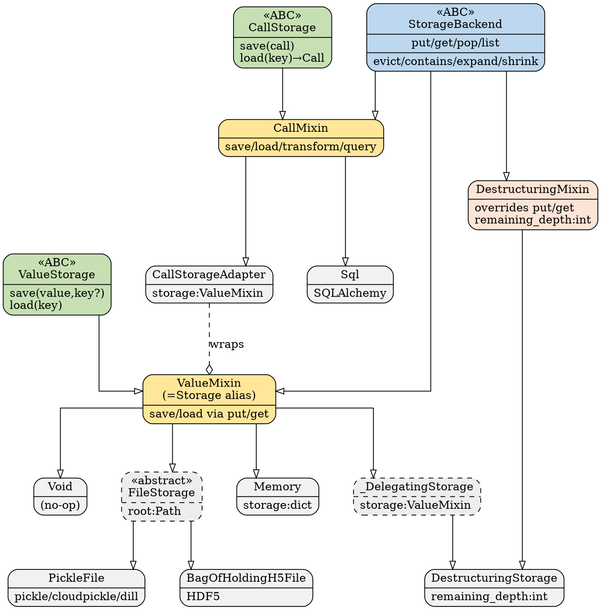

# Storage Class Hierarchy

This document describes the class hierarchy introduced in PR #249 for
`fleche`'s storage subsystem.


> The SVG is generated by `devnotes/make_svg.py` (pure Python, no external
> tools required). Re-run it after any hierarchy changes to keep the diagram
> in sync.

---

## Overview

The storage subsystem is split into three orthogonal concerns, each represented
by a distinct layer in the class hierarchy:

| Layer | Purpose | Key types |
|---|---|---|
| **Abstract Backend** | Primitive key/value operations | `StorageBackend` |
| **Domain Interfaces** | Type-safe save/load contracts | `ValueStorage`, `CallStorage` |
| **Bridge Mixins** | Connect domain interfaces to a backend | `ValueMixin`, `CallMixin` |
| **Concrete Backends** | Actual storage implementations | `Memory`, `PickleFile`, `Sql`, … |

---

## Layer 1 — `StorageBackend` (ABC)

```
StorageBackend(ABC)
├── put(value, key) : Digest        ← abstract
├── get(key) : Any                  ← abstract
├── pop(key)                        ← abstract
├── list() : Iterable[Digest]       ← abstract
│
└── (concrete key-management helpers)
    ├── evict(key)          normalises str → Digest, then calls pop()
    ├── contains(key) : bool
    ├── expand(key)         resolves a short prefix to the full digest
    └── shrink(key)         finds the shortest unambiguous prefix
```

`StorageBackend` is the lowest-level contract.  Any class that stores
key-value pairs—whether in memory, on disk, or in a database—implements
`put`/`get`/`pop`/`list`.  The key-management helpers (`evict`, `contains`,
`expand`, `shrink`) are implemented once here and inherited by everyone.

---

## Layer 2 — Domain Interfaces (`ValueStorage`, `CallStorage`)

These ABCs express **what** is stored, independent of **how**:

```
ValueStorage(ABC)
├── save(value: Any, key?: Digest) : Digest
└── load(key: Digest | str) : Any

CallStorage(ABC)
├── save(call: Call) : Digest
└── load(key: Digest | str) : Call
```

Neither interface inherits from `StorageBackend`.  This separation keeps
the domain contracts free of backend concerns and allows them to be
type-checked in isolation.

---

## Layer 3 — Bridge Mixins (`ValueMixin`, `CallMixin`, `DestructuringMixin`)

The bridge mixins combine a domain interface with `StorageBackend` using
multiple inheritance, providing concrete implementations of `save`/`load`
in terms of `put`/`get`:

```python
class ValueMixin(ValueStorage, StorageBackend):
    def save(self, value, key=None):
        if key is None:
            key = digest(value)     # hash the value if no key given
        return self.put(value, key)

    def load(self, key):
        key = self.expand(key) if len(key) < DIGEST_LENGTH else Digest(key)
        return self.get(key)

Storage = ValueMixin  # backward-compatibility alias
```

```python
class CallMixin(CallStorage, StorageBackend):
    def save(self, call: Call):
        key = call.to_lookup_key()  # key derived from call identity
        if self.contains(str(key)):
            self.evict(str(key))    # evict stale entry before overwrite
        return self.put(call, key)

    def load(self, key):
        key = self.expand(key) if len(key) < DIGEST_LENGTH else Digest(key)
        return self.get(key)

    # Extra domain methods only meaningful for calls:
    def transform(self, func): ...
    def query(self, template: QueryCall): ...
```

`DestructuringMixin` hooks in at the *backend* level—it overrides `put`/`get`
on `StorageBackend` to transparently split nested collections (lists, dicts)
into individually-stored sub-values.  Because it inherits only from
`StorageBackend` it can be composed into either a value or call storage chain:

```python
class DestructuringMemoryValues(ValueMixin, DestructuringMixin, Memory):
    pass
```

---

## Layer 4 — Concrete Backends

### Value backends (inherit from `ValueMixin`)

| Class | Storage medium | Notes |
|---|---|---|
| `Memory` | Python `dict` | Deep-copies on put/get to prevent aliasing |
| `Void` | Nothing (no-op) | Useful as a placeholder or in tests |
| `FileStorage` | Filesystem | Abstract; subclasses implement `_to_file`/`_from_file` |
| `PickleFile` | Files (pickle/cloudpickle/dill) | HMAC-signed, optional gzip compression |
| `BagOfHoldingH5File` | HDF5 files | Via the `bagofholding` library |
| `_DelegatingStorage` | Another `ValueMixin` | Delegates all primitives to a wrapped instance |
| `DestructuringStorage` | Wraps any `ValueMixin` | Backward-compat wrapper combining `DestructuringMixin` + `_DelegatingStorage` |

### Call backends (inherit from `CallMixin`)

| Class | Storage medium | Notes |
|---|---|---|
| `Sql` | SQLAlchemy (default: SQLite) | Stores `Call` fields in a relational schema; `query()` pushes filters to SQL |
| `CallStorageAdapter` | Another `ValueMixin` | Adapts a value storage into a call storage by delegating all primitives |

---

## Composition patterns

The mixin design enables clean composition for more complex backends:

```python
# Destructuring + signing + pickle, for values
class SecurePickleValues(ValueMixin, DestructuringMixin, PickleFile):
    pass

# Plain memory backend for calls
class MemoryCalls(CallMixin, Memory):
    pass
```

`Cache` (in `caches.py`) combines one value storage with one call storage:

```python
@dataclass
class Cache(BaseCache):
    values: ValueStorage    # e.g. Memory() or PickleFile(...)
    calls:  CallStorage     # e.g. CallStorageAdapter(Memory()) or Sql()
```

---

## DOT source

The diagram above was laid out using the following DOT source
(render with `dot -Tsvg storage-hierarchy.dot -o storage-hierarchy.svg`
or regenerate with `python3 devnotes/make_svg.py`):


