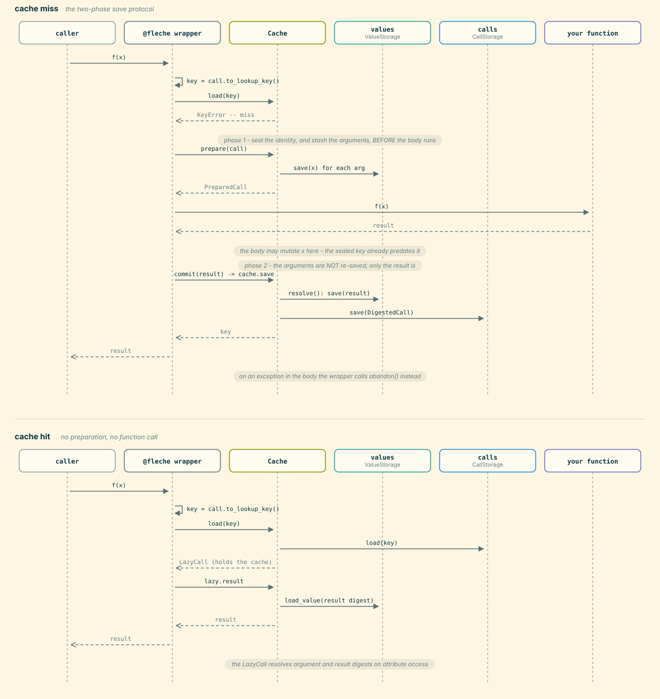

The lifecycle of a cached call
==============================

Between ``f(x)`` and a record on disk, a decorated function passes through
the wrapper, a cache, and two storages.  The interesting part is that the
record's *identity* is fixed before the function body runs, while its
*result* can only be stored afterwards — which is why saving is a two-phase
protocol rather than a single call.

This page is for people changing that machinery.  For using the decorator,
see :doc:`../usage/tldr`; for what the storages underneath are made of, see
:doc:`storage_hierarchy`.

         shows prepare stashing arguments before the function body runs and
         commit storing only the result afterwards; the hit panel shows the
         record loaded from call storage and its values fetched lazily.
   :width: 100%

Why saving is two-phase
-----------------------

A cache record is keyed on the call's arguments.  The obvious implementation
digests them when you file the record — that is, *after* the body has run.
That is wrong whenever the body mutates an argument:

.. code-block:: python

   @fleche()
   def normalize(rows):
       rows.sort()          # mutates the caller's list
       return len(rows)

Digest ``rows`` after the body and the record is keyed on the *sorted* list.
The next call with the original unsorted list computes a different lookup key,
misses, and runs again — and stores a second record.  The cache never hits,
and the two records disagree about what ``rows`` was.

So :meth:`~fleche.caches.BaseCache.prepare` seals the identity up front:

#. **Phase 1 —** :meth:`~fleche.caches.BaseCache.prepare` digests the
   arguments and, for a cache that owns a value storage, stores them too.  It
   returns a :class:`~fleche.call.PreparedCall`: a record whose key is final
   and whose result is still ``None``.
#. The body runs.  It may mutate whatever it likes.
#. **Phase 2 —** :meth:`~fleche.call.PreparedCall.commit` attaches the result
   and files the record.  The arguments are **not** re-read; only the result
   is stored, exactly as returned.

:meth:`~fleche.caches.Cache.save` is explicit about that second point — the
``PreparedCall`` branch calls
:meth:`~fleche.call.PreparedCall.resolve`, which saves the pending result and
otherwise reuses the digests sealed at prepare time.  Re-stashing there would
reintroduce precisely the bug the protocol exists to prevent.

Finishing a prepared call
-------------------------

Every :class:`~fleche.call.PreparedCall` must end in exactly one of
:meth:`~fleche.call.PreparedCall.commit` or
:meth:`~fleche.call.PreparedCall.abandon`.  It is a context manager, so the
safe form needs no ``try``:

.. code-block:: python

   with cache.prepare(call) as prepared:
       prepared.commit(func(...))     # skipped if func raises -> abandoned

``__exit__`` abandons whenever the block is left without a commit.
:meth:`~fleche.call.PreparedCall.abandon` is a no-op by default and
idempotent — argument values already written in phase 1 are
content-addressed orphans, which a later garbage-collection sweep reclaims,
so there is nothing to roll back.  Only
:meth:`~fleche.call.PreparedCall.commit` is barred afterwards: committing a
call that was already committed or abandoned raises :class:`RuntimeError`,
while ``abandon`` never raises no matter how often it is called.

:mod:`fleche.wrapper` does not use the ``with`` form, because the commit may
happen in a future's done-callback rather than on the calling thread, but it
follows the same rule: it abandons on an exception from the body, and on a
``None`` result, which fleche declines to cache.

Around the two-phase save
--------------------------

The two sections above cover what :meth:`~fleche.caches.BaseCache.prepare`
and :meth:`~fleche.call.PreparedCall.commit`/:meth:`~fleche.call.PreparedCall.abandon`
do once the wrapper has decided to run them.  What decides *whether* and
*when* they run lives in :func:`fleche.wrapper.make_wrapper` — specifically
``wrapper()`` and the ``_run_and_cache``/``_cache`` closures nested inside it
(currently around lines 190-327 of :mod:`fleche.wrapper`; read that region
directly if you need exact behaviour, since line numbers drift).

- **Hit, miss, and concurrent de-dup.**  The wrapper computes the call's
  lookup key and tries ``cache.load(key).result`` first; a hit returns that
  result directly and never touches ``prepare``/``commit`` at all.  On a
  miss, before running the body it also checks a per-wrapper ``_in_flight``
  map keyed by the same digest: if another in-progress call for the same key
  is already mid-save — its result is resolved but the cache write hasn't
  finished — the wrapper just awaits that save's future instead of invoking
  the function a second time.

- **Metadata hooks around prepare/commit.**  Each active
  :class:`~fleche.metadata.MetaData`'s ``pre()`` runs *before*
  ``cache.prepare(call)``, and its ``post()`` runs *after* the function body
  has returned but *before* ``prepared.commit(...)`` — ``post`` sees both its
  own ``pre`` output and the call's result, and both are folded into the
  metadata dict that gets committed alongside the result.

- **The Future path.**  When the body returns a
  :class:`concurrent.futures.Future` instead of a plain value, the wrapper
  does not commit on the calling thread: it wires the save up as
  ``result.add_done_callback(_cache)`` and returns the future unresolved. The
  callback runs whenever the future settles; if it resolved with an
  exception, ``future.result()`` re-raises inside the callback and that
  triggers ``prepared.abandon()`` instead of a commit — the same outcome as a
  body that raises synchronously.

- **Two uncached fallbacks.**  Before any of the above, the wrapper needs a
  lookup key for the call; if it can't get one, it runs
  ``func(*args, **kwargs)`` uncached rather than failing the call:

  - *Indigestible argument* — building the key raises
    :exc:`~fleche.digest.Indigestible` because some argument can't be
    hashed, so no key can be sealed.
  - *Missing* :class:`~fleche.call.Required` *kwarg* — a parameter annotated
    ``Required`` was not passed explicitly by the caller (its default was
    used instead); the wrapper warns and declines to cache rather than key
    on a value the caller never chose.

  Both cases log a warning before falling back; see :mod:`fleche.wrapper`
  for the exact checks.

Caches that cannot write ahead of the body
------------------------------------------

The default :meth:`~fleche.caches.BaseCache.prepare` on
:class:`~fleche.caches.BaseCache` is digest-only — it seals the key without
storing anything, via :meth:`~fleche.call.Call.digest` instead of
:meth:`~fleche.call.Call.stash`.  That is the right behaviour for caches with
no value storage of their own: read-only views, aggregates, wrappers.

Both paths seal the *same* key, because ``digest(x)`` and ``values.save(x)``
return the same digest for the same value — content addressing is what lets
the two admissions be interchangeable.

:class:`~fleche.caches.ReadOnlyMixin` shows the pattern at its sharpest.  It
restates the digest-only ``prepare`` (it is base-free, so it must beat
:class:`~fleche.caches.CacheWrapper` in the MRO) and raises
:class:`~fleche.caches.Rejected` from ``save``.  The effect on a decorated
call is: the key is sealed, the body runs normally, the commit is refused, and
the caller gets an uncached result.  The wrapper logs the rejection and
carries on — a cache refusing to store is never an error at the call site.

That tolerance is deliberate and broader than
:class:`~fleche.caches.Rejected`.  If ``prepare`` raises anything at all — a
storage fault, a dropped connection — the wrapper logs it and calls the
function uncached rather than failing before the body ever ran.

The one-shot form
-----------------

:meth:`~fleche.caches.Cache.save` also accepts a live
:class:`~fleche.call.Call` whose result is already set, and stashes its values
on the spot.  This is what :meth:`~fleche.caches.BaseCache.transfer` and the
query layer use.  It is safe precisely because nothing runs between digesting
and filing: with no function body in the middle, there is no mutation window
for the two-phase protocol to close.

Reading a record back
---------------------

:meth:`~fleche.caches.Cache.load` fetches the
:class:`~fleche.call.DigestedCall` from call storage and calls ``fetch(self)``
on it, producing a :class:`~fleche.call.LazyCall`: the same record with a
reference to the cache attached, but with arguments and result still
digests.

Nothing is read from value storage until you ask.
:attr:`~fleche.call.LazyCall.result` loads the result digest on access, and
:attr:`~fleche.call.LazyCall.arguments` hands back a lazy mapping that loads
each argument as it is looked up.  So querying a thousand records to inspect
their metadata costs a thousand call-storage reads and no value reads at all —
which is the point of splitting the two storages in the first place.
:meth:`~fleche.call.LazyCall.detach` drops the cache reference again, giving
back a plain :class:`~fleche.call.DigestedCall` that can cross a process
boundary.

Where this lives
----------------

.. list-table::
   :header-rows: 1
   :widths: 30 70

   * - Module
     - Responsibility
   * - :mod:`fleche.wrapper`
     - The decorated-function path: build the ``Call``, look it up, run the
       body, prepare/commit/abandon around it, de-duplicate concurrent calls
       for the same key.
   * - :mod:`fleche.caches`
     - :meth:`~fleche.caches.BaseCache.prepare` and
       :meth:`~fleche.caches.Cache.save`, the value/call storage pair, and the
       wrapper/stack/pool variants that re-implement admission.
   * - :mod:`fleche.call`
     - :class:`~fleche.call.Call`,
       :class:`~fleche.call.DigestedCall`,
       :class:`~fleche.call.PreparedCall`, and
       :class:`~fleche.call.LazyCall` — the four states a record passes
       through, and the ``stash``/``digest``/``resolve``/``fetch`` conversions
       between them.

Regenerating the figure
-----------------------

.. code-block:: bash

   python docs/figures/gen_sequence.py

The same script emits the storage sequence diagram on
:doc:`storage_hierarchy`; see that page's closing section for why the SVGs are
checked in rather than rendered at build time.
