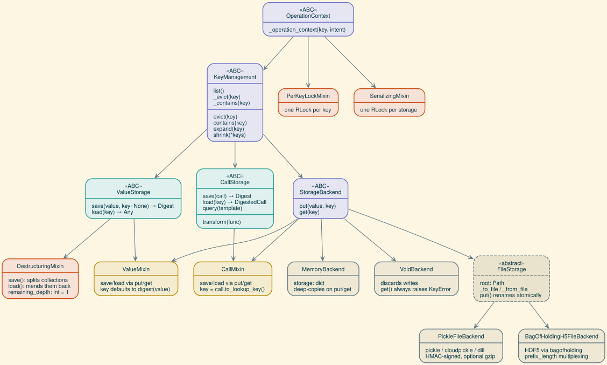
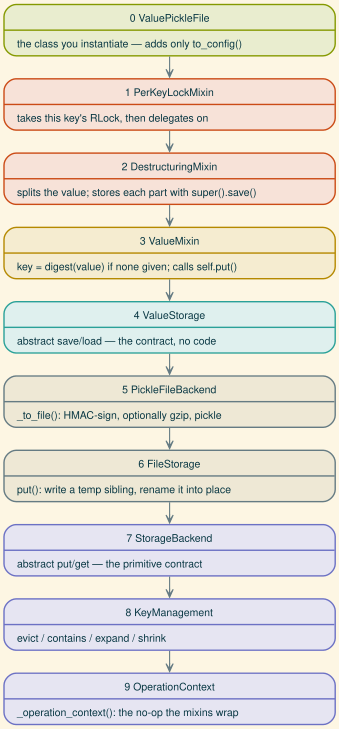

Storage class hierarchy
=======================

A storage class in fleche answers two independent questions: **what** it
stores (values, or call records) and **how** it stores them (a dict, files,
a database).  The class hierarchy keeps those two axes apart, so the nine
concrete storages in :mod:`fleche.storage` are almost all one-liners that
name a domain mixin and a backend and add nothing else.

This page is a map of that hierarchy for people changing fleche itself.  If
you only want to *choose* a backend, :doc:`../storage/configuration` is the
page you want.

         OperationContext through the key-management, primitive, and domain
         layers down to the backend implementations.
   :width: 100%

Arrows point from base class to subclass.  Everything above is abstract or a
mixin; the concrete classes are assembled from them in the table further
down.

The abstract skeleton
---------------------

:class:`~fleche.storage.base.OperationContext`
    The root, and the only thing the cache layer shares with the storage
    layer.  It defines one hook,
    :meth:`~fleche.storage.base.OperationContext._operation_context`, a
    context manager entered around every operation on a key; the base
    implementation does nothing.  :class:`~fleche.caches.BaseCache` inherits
    from it too, which is what lets the same locking mixins attach to either
    layer.

:class:`~fleche.storage.base.KeyManagement`
    Everything that is about *keys* rather than about content.  Subclasses
    supply ``list``, ``_evict``, and ``_contains``; in exchange they inherit
    :meth:`~fleche.storage.base.KeyManagement.evict`,
    :meth:`~fleche.storage.base.KeyManagement.contains`,
    :meth:`~fleche.storage.base.KeyManagement.expand` (short digest prefix →
    full digest, raising
    :class:`~fleche.storage.base.AmbiguousDigestError` when the prefix
    matches more than one key) and
    :meth:`~fleche.storage.base.KeyManagement.shrink` (the reverse: the
    shortest prefix that is still unambiguous, batched over several keys so
    ``list()`` is fetched once).

    Backends that can push a prefix scan down to the store override
    ``_prefix_candidates`` — :class:`~fleche.storage.sql.Sql` does this with a
    ``LIKE … LIMIT 2`` query — rather than reimplementing ``expand``.

:class:`~fleche.storage.base.StorageBackend`
    Adds the primitive key-value contract on top of key management: ``put``
    and ``get``, plus a default ``_contains`` that just tries ``get`` and
    catches :class:`KeyError`.  This is the layer that knows about *media*
    and nothing about what a value means.

:class:`~fleche.storage.base.ValueStorage` and :class:`~fleche.storage.base.CallStorage`
    The domain interfaces: ``save``/``load`` typed for arbitrary values, and
    ``save``/``load``/``query`` typed for
    :class:`~fleche.call.DigestedCall` records.  Both inherit
    :class:`~fleche.storage.base.KeyManagement` *directly*, not
    :class:`~fleche.storage.base.StorageBackend`.  That is deliberate: it
    keeps the domain contracts free of ``put``/``get``, and it is what allows
    :class:`~fleche.storage.sql.Sql` to be a
    :class:`~fleche.storage.base.CallStorage` without pretending to be a
    key-value store.

    :class:`~fleche.storage.base.CallStorage` also carries one concrete
    method, :meth:`~fleche.storage.base.CallStorage.transform`, which reloads
    every record through a function and re-files it under its new lookup key.

Bridge mixins
-------------

:class:`~fleche.storage.base.ValueMixin` and
:class:`~fleche.storage.base.CallMixin` are the joins: each inherits a domain
interface *and* :class:`~fleche.storage.base.StorageBackend`, and implements
the domain ``save``/``load`` in terms of the primitive ``put``/``get``.  They
are the whole reason a concrete class needs no method bodies.

The two differ in where the key comes from.
:class:`~fleche.storage.base.ValueMixin` hashes the value
(``key = digest(value)``) unless one is passed in;
:class:`~fleche.storage.base.CallMixin` takes it from the record
(``key = call.to_lookup_key()``) and evicts any existing entry first, because
a re-save under the same lookup key is an overwrite rather than a second
entry.  :meth:`~fleche.storage.base.CallMixin.query` is a Python-side scan:
load every key, keep the ones the template matches.

Cross-cutting mixins
--------------------

Three mixins are orthogonal to both axes and can be layered onto anything.

:class:`~fleche.storage.destructuring.DestructuringMixin`
    A :class:`~fleche.storage.base.ValueStorage` subclass that overrides
    ``save``/``load`` to take collections apart, store each part under its own
    content digest, and reassemble them on load.  It composes only with a
    value chain — destructuring a call record has no meaning.  See
    :doc:`../storage/destructuring` for what it does and
    :doc:`extending_destructurer` for how to register new container types.

:class:`~fleche.storage.thread_safe.PerKeyLockMixin`
    An :class:`~fleche.storage.base.OperationContext` subclass that overrides
    ``_operation_context`` to take a per-key :class:`~threading.RLock` from a
    striped table.  Operations on different keys run in parallel; operations
    on the same key serialize.  Instances must be hashable, since the lock
    table is a :class:`~weakref.WeakKeyDictionary` keyed on the storage.

:class:`~fleche.storage.thread_safe.SerializingMixin`
    The same idea with a single lock for the whole storage.  Use it when the
    backing store is not safe for concurrent access at all.

Both locking mixins chain through ``super()._operation_context(...)``, so
stacking several of them — or stacking one on
:class:`~fleche.storage.sql.Sql`, whose own ``_operation_context`` opens a
session — nests the resources instead of shadowing them.  Both are also
skipped entirely for :attr:`~fleche.storage.base.Intent.READ`, which is
currently a no-op reserved for a future reader-writer lock; because it grants
no mutual exclusion today, it must never guard a read-modify-write sequence.

Backend implementations
-----------------------

These implement the :class:`~fleche.storage.base.StorageBackend` primitives
for one medium.  None of them is typed value-vs-call; that is the mixins' job.

.. list-table::
   :header-rows: 1
   :widths: 30 20 50

   * - Class
     - Medium
     - Notes
   * - :class:`~fleche.storage.memory.MemoryBackend`
     - a Python :class:`dict`
     - Deep-copies on both ``put`` and ``get``, so mutating a loaded object
       cannot reach back into the store.  Subclasses must restate
       ``__hash__ = object.__hash__`` — ``__init_subclass__`` raises if they
       forget, because the unhashable ``storage`` field would otherwise break
       :class:`~fleche.storage.thread_safe.PerKeyLockMixin`.
   * - :class:`~fleche.storage.void.VoidBackend`
     - nothing
     - ``put`` discards, ``get`` always raises :class:`KeyError`.  A
       null object for tests and for "compute but don't cache".
   * - :class:`~fleche.storage.file.FileStorage`
     - the filesystem
     - Abstract; one file per key.  ``put`` writes a dot-prefixed temp
       sibling and :func:`os.replace`\ s it into place, so readers never see
       a partial entry and no lock file is needed.  Subclasses supply
       ``_to_file``/``_from_file`` — which must therefore write a *complete*
       file at whatever path they are handed.
   * - :class:`~fleche.storage.pickle_file.PickleFileBackend`
     - files
     - ``pickle``, ``cloudpickle``, or ``dill``, chosen by the ``with_*``
       constructor rather than by a field.  Payloads are HMAC-signed and
       optionally gzipped.
   * - :class:`~fleche.storage.bagofholding_file.BagOfHoldingH5FileBackend`
     - HDF5 files
     - Via :mod:`bagofholding`.  ``prefix_length`` multiplexes keys sharing a
       prefix into one bag; that mode mutates shared files in place, so it
       keeps cross-process ``filelock`` locking, while ``prefix_length=0``
       inherits the lock-free atomic-rename path.

The concrete classes
--------------------

Each concrete storage is a mixin stack over a backend, and — with one
exception — contains nothing but a ``to_config``.

.. list-table::
   :header-rows: 1
   :widths: 34 66

   * - Class
     - Bases
   * - :class:`~fleche.storage.memory.ValueMemory`
     - ``PerKeyLockMixin, DestructuringMixin, ValueMixin, MemoryBackend``
   * - :class:`~fleche.storage.pickle_file.ValuePickleFile`
     - ``PerKeyLockMixin, DestructuringMixin, ValueMixin, PickleFileBackend``
   * - :class:`~fleche.storage.bagofholding_file.ValueBagOfHoldingH5File`
     - ``PerKeyLockMixin, DestructuringMixin, ValueMixin, BagOfHoldingH5FileBackend``
   * - :class:`~fleche.storage.void.ValueVoid`
     - ``ValueMixin, VoidBackend``
   * - :class:`~fleche.storage.memory.CallMemory`
     - ``PerKeyLockMixin, CallMixin, MemoryBackend``
   * - :class:`~fleche.storage.pickle_file.CallPickleFile`
     - ``PerKeyLockMixin, CallMixin, PickleFileBackend``
   * - :class:`~fleche.storage.bagofholding_file.CallBagOfHoldingH5File`
     - ``PerKeyLockMixin, CallMixin, BagOfHoldingH5FileBackend``
   * - :class:`~fleche.storage.void.CallVoid`
     - ``CallMixin, VoidBackend``
   * - :class:`~fleche.storage.sql.Sql`
     - ``PerKeyLockMixin, CallStorage``

Two patterns fall out of that table.  Every value storage stacks
:class:`~fleche.storage.destructuring.DestructuringMixin`, so destructuring is
the default rather than an opt-in.  And the two ``Void`` classes take no lock:
there is no state to protect.

What the MRO actually does
--------------------------

Take :class:`~fleche.storage.pickle_file.ValuePickleFile`.  Its four bases
linearize like this, and a single ``save()`` walks straight down the chain:

         each annotated with what it contributes to a save() call.
   :width: 62%
   :align: center

Reading it as one call, ``storage.save([1, [2, 3]])``:

#. :class:`~fleche.storage.thread_safe.PerKeyLockMixin` wraps the operation in
   this key's ``RLock`` (reentrant, so the nested ``expand`` inside a later
   ``load`` cannot deadlock against it).
#. :class:`~fleche.storage.destructuring.DestructuringMixin` walks the
   collection, stores ``[2, 3]`` through ``super().save()``, and replaces it
   with its digest in the parent entry.
#. :class:`~fleche.storage.base.ValueMixin` — the ``super()`` those recursive
   calls land on — hashes each entry if no key was supplied and calls
   ``self.put()``.
#. ``put`` resolves to :class:`~fleche.storage.file.FileStorage`, which asks
   :class:`~fleche.storage.pickle_file.PickleFileBackend` to serialize into a
   temp file and then renames it over the real path.

Note where :class:`~fleche.storage.base.ValueStorage` sits: *between*
:class:`~fleche.storage.base.ValueMixin` and the backend, not above both.
That is C3 linearization doing its job — the domain contract is satisfied
before the medium is consulted, which is why swapping
:class:`~fleche.storage.pickle_file.PickleFileBackend` for
:class:`~fleche.storage.memory.MemoryBackend` changes nothing about the first
half of the chain.

The exception: ``Sql``
----------------------

:class:`~fleche.storage.sql.Sql` is the one concrete class that is not
mixin × backend.  It implements :class:`~fleche.storage.base.CallStorage`
directly and is *not* a :class:`~fleche.storage.base.StorageBackend` — it
exposes no ``put``/``get`` at all.  Three things drive that:

* **Records are rows, not blobs.**  A call is spread over three tables
  (``calls``, ``arguments``, ``metadata``), so there is no single opaque
  payload for ``put`` to take.
* **Queries belong in the database.**
  :meth:`~fleche.storage.sql.Sql.query` compiles name, module, version, and
  argument filters into SQL instead of scanning every key the way
  :meth:`~fleche.storage.base.CallMixin.query` does.
* **Sessions are the operation context.**  ``Sql`` overrides
  ``_operation_context`` to open a thread-local session and chain to
  ``super()``, which is where its
  :class:`~fleche.storage.thread_safe.PerKeyLockMixin` lock is taken.

It also folds ``contains`` + ``evict`` + ``put`` into a single ``_persist_call``
transaction rather than three round-trips.

Registration and config
-----------------------

:func:`~fleche.storage.base.register_storage` maps a ``(name, kind)`` pair
from a config file onto a constructor, and is what makes a class acceptable to
:func:`fleche.config.storage_to_config` in the other direction.  Two details
matter when adding a backend:

* The check is **exact-class**, not ``issubclass``.  A subclass inherits its
  parent's ``to_config`` and would serialize under the parent's ``type``, then
  silently round-trip back as the parent — so an unregistered subclass is
  refused instead.
* ``to_config`` is hand-written on every registered class.  There is no
  inherited default, because a backend's config keys are a contract, not
  whatever its dataclass fields happen to be.

One class may register under several names when a constructor argument picks
the variant: :class:`~fleche.storage.pickle_file.ValuePickleFile` is reachable
as ``pickle``, ``dill``, and ``cloudpickle`` through its ``with_*``
constructors, and its ``to_config`` reads the serializer back off the
instance.

Composing your own
------------------

A :class:`~fleche.caches.Cache` is just one value storage plus one call
storage, so any pair works::

    from fleche.caches import Cache
    from fleche.storage import ValueMemory, Sql

    cache = Cache(values=ValueMemory({}), calls=Sql(url="sqlite:///calls.db"))

New combinations follow the table above — mixins first, backend last::

    from dataclasses import dataclass
    from fleche.storage import SerializingMixin, ValueMixin, MemoryBackend
    from fleche.storage.destructuring import DestructuringMixin

    @dataclass(frozen=True)
    class SerializedValueMemory(
        SerializingMixin, DestructuringMixin, ValueMixin, MemoryBackend
    ):
        __hash__ = object.__hash__

Order is not cosmetic: the mixins work by overriding ``save``/``load`` or
``_operation_context`` and delegating with ``super()``, so a mixin placed
*after* the backend never runs.  A new class that config files should be able
to name additionally needs a ``to_config`` and a
:func:`~fleche.storage.base.register_storage` call.

Regenerating the figures
------------------------

Both diagrams on this page are Graphviz sources checked in next to their
output:

.. code-block:: bash

   dot -Tsvg docs/figures/storage_hierarchy.dot -o docs/figures/storage_hierarchy.svg
   dot -Tsvg docs/figures/storage_mro.dot -o docs/figures/storage_mro.svg

They use the same solarized-light palette as ``docs/_static/custom.css`` and
the destructuring figures, so a retheme means touching all three.
