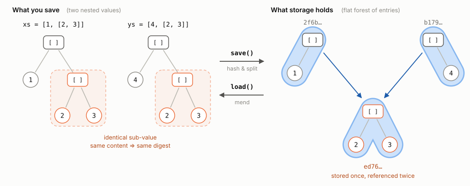
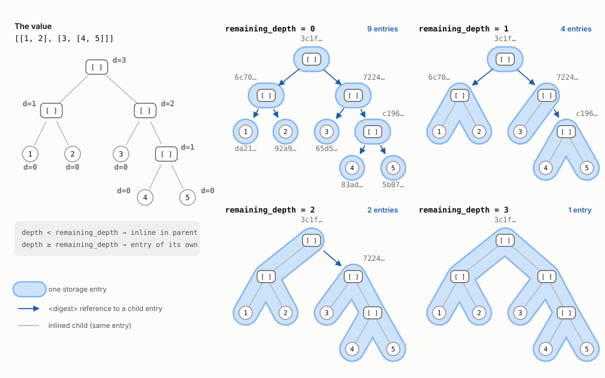
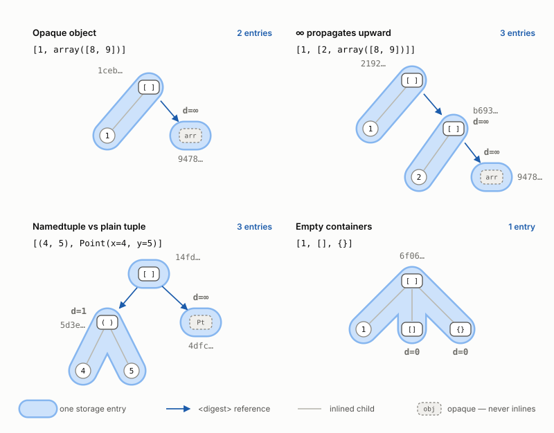

Destructuring
=============

Most value backends (``"memory"``, ``"pickle"``, ``"cloudpickle"``, ``"dill"``,
``"bagofholding_hdf"``) do not store a collection as one opaque blob.  Instead
they *destructure* it: the collection is recursively taken apart, each part is
stored as its own entry under the SHA-256 digest of its content, and the parent
entry keeps digest references in place of the parts it lost.  On load the
references are followed and the original nesting is reassembled ("mended") —
the process is invisible to the caller.

Because entries are keyed by content, destructuring deduplicates: any
sub-structure that appears in more than one saved value — or many times inside
the same value — is stored exactly once.

Containers that are destructured: :class:`list`, :class:`tuple`,
:class:`dict`, :mod:`dataclasses` instances, and ``attrs`` instances.
Everything else is treated as an opaque leaf (see `Special cases`_).

Deduplication
-------------

The figure below shows two saved values that share the sub-list ``[2, 3]``.
The sub-list digests identically in both saves, so the second save finds the
entry already present; each parent stores a digest reference in its place.

         three entries where the shared sub-list appears once.
   :width: 100%

The digest labels are real — the layouts in all figures on this page are built
in code in the :doc:`Destructuring notebook <../notebooks/Destructuring>`,
which reproduces every label shown here.

The ``remaining_depth`` parameter
---------------------------------

How finely a value is split is controlled by the ``remaining_depth`` option of
the value backend (integer, default ``1``).  Depth is measured *up from the
leaves*: a scalar (:class:`int`, :class:`str`, :class:`bytes`, …) has depth 0,
and a container has depth ``1 + max(child depths)``.  Note that this is not
the distance from the root — two siblings can have different depths.

The rule is a single comparison:

* a node whose depth is **less than** ``remaining_depth`` is inlined into its
  parent's entry;
* a node whose depth is **greater than or equal to** ``remaining_depth``
  becomes an entry of its own, referenced by digest.

         remaining_depth 0, 1, 2, and 3.
   :width: 100%

With ``remaining_depth = 0`` every node is stored separately — maximal
splitting and maximal sharing between saves.  With the default
``remaining_depth = 1`` scalars are inlined into their parent container, so a
flat list of numbers is a single entry while nested sub-collections still
split off.  Higher values produce fewer, larger entries and less structural
sharing.  The top-level value always gets an entry, whatever the setting.

Because entries are content-addressed, a value's digest does not depend on how
it was split: the same value saved under any ``remaining_depth`` yields the
same key (which is why one set of digest labels serves all four panels above).

``remaining_depth`` is set per value backend in your ``fleche.toml`` cache
section — see :ref:`configuring-destructuring` in the configuration reference
for the syntax.

Special cases
-------------

A few kinds of value deliberately break the depth pattern:

         namedtuples versus plain tuples, and empty containers.
   :width: 100%

**Opaque objects.**  Values with no registered destructurer — numpy arrays,
sets, arbitrary objects — are assigned depth ∞.  They can never be inlined and
always get an entry of their own, at every ``remaining_depth``.

**∞ propagates upward.**  Since a container's depth is
``1 + max(child depths)``, a container holding an opaque value is depth ∞ as
well and also splits at every setting.

**Namedtuples.**  A plain tuple destructures normally, but a
:func:`~collections.namedtuple` is kept opaque on purpose: its constructor
does not accept a single iterable the way :class:`tuple` does, so fleche
refuses to take it apart.

**Empty containers.**  ``[]``, ``()``, and ``{}`` count as scalars (depth 0):
there is nothing to split, so they inline with their parent like any other
leaf.

Extending and inspecting
------------------------

:func:`~fleche.storage.register_destructurer` teaches the storage to split
additional container types; see :doc:`../dev/extending_destructurer` for the
registration contract.

Two introspection helpers expose the reference graph without mending:
:meth:`~fleche.storage.destructuring.DestructuringMixin.child_digests` returns
the digests an entry references directly (the arrows in the figures), and
:meth:`~fleche.storage.destructuring.DestructuringMixin.count_reuses` tallies
how often each entry is referenced by others — useful for spotting shared
structure and for GC-style audits.

.. _destructuring-no-load:

Auditing a store you cannot load
--------------------------------

Both helpers above deserialize each entry to find its references, so both need
every class the payloads mention to be importable.  That is exactly what an
*archived* cache cannot offer: the project that wrote it may be a version
behind, uninstalled, or somebody else's altogether, and
``count_reuses()`` then fails on the import rather than on anything to do with
the cache.

Pass ``load=False`` to read the references straight off the serialized entries
instead::

    >>> values.count_reuses(load=False)          # doctest: +SKIP
    Counter({'ed76af7c…': 2, '2f6b57d5…': 0, 'b179c9b7…': 0})

The counts are identical either way — only the route differs.  The no-load
route walks the pickle opcode stream, or the bagofholding HDF5 groups, without
importing a single name from the payload and without calling any ``__reduce__``
the file asks for; a
:meth:`~fleche.storage.destructuring.DestructuringMixin.scan_child_digests`
per-entry variant is available for the same reason.
:meth:`~fleche.caches.Cache.gc` takes the same flag, which is what makes a
sweep over a foreign store possible — call records hold only digests, strings,
and JSON metadata, so it is only the value walk that ever needed the payload
classes.

Support is per backend: ``ValueMemory`` (nothing is serialized to begin with),
``ValuePickleFile`` in all three serializer flavours, and
``ValueBagOfHoldingH5File`` in both prefix layouts.  A value storage that
cannot offer the scan raises
:class:`~fleche.storage.scan.ScanUnsupported` rather than quietly falling back
to a load — with ``gc(load=False)``, refusing is the safe answer, since a
reference graph that cannot be read must never be mistaken for an empty one.

Trying it out
-------------

The :doc:`Destructuring notebook <../notebooks/Destructuring>` rebuilds every
layout shown on this page in a ``ValueMemory`` storage and prints the raw
entries, so you can experiment with your own values.
